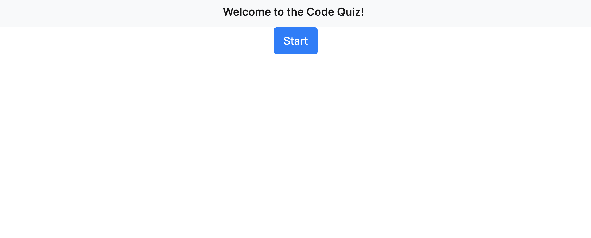
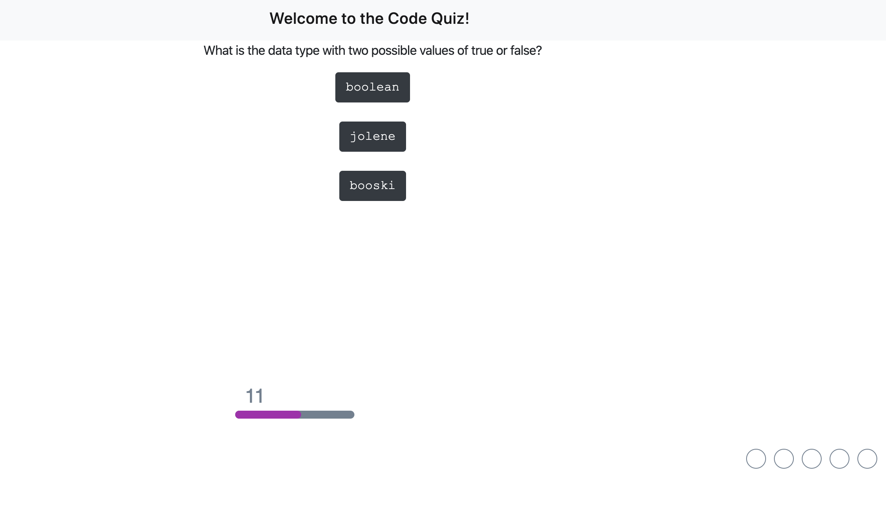
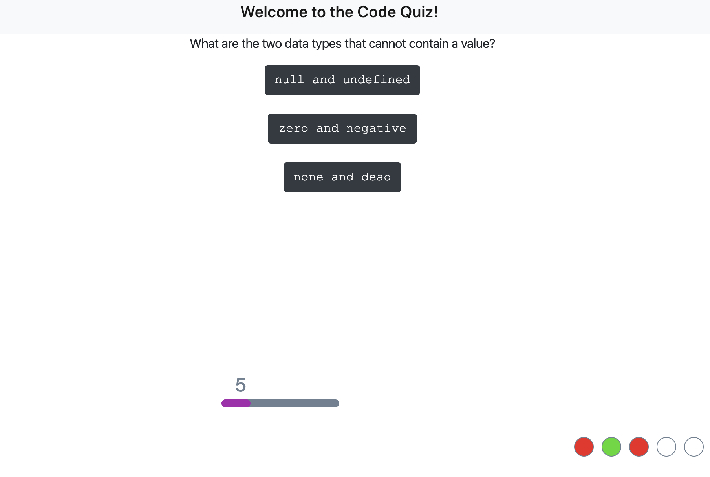
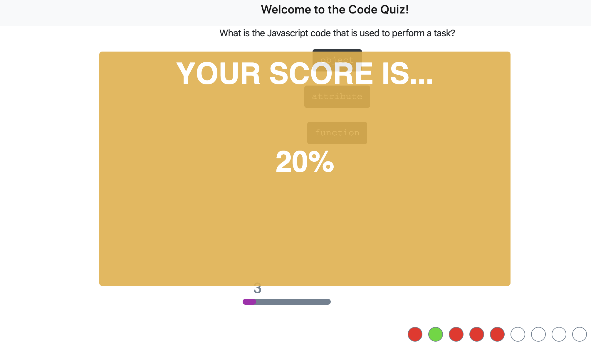

# code-quiz
Homework #4

Welcome to the Code Quiz.

Here you'll find a quick 5 question coding quiz. Test your knowledge on the basics of HTML, CSS, and JavaScript.

Play it here: https://dsorthep.github.io/code-quiz/

